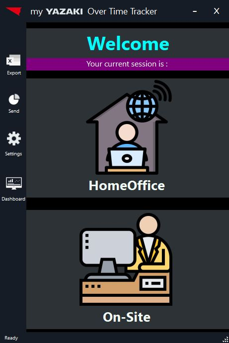
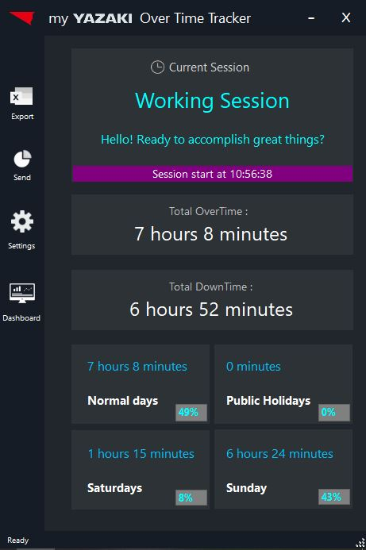
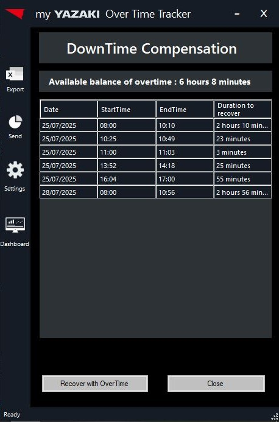
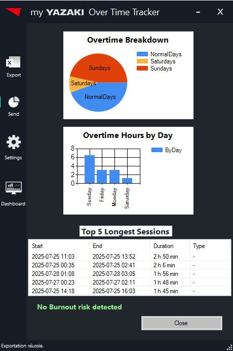

# WOTTracker - YAZAKI Over Time Tracker 🕒


**WOTTracker** (Work OverTime Tracker) est une application de bureau pour Windows conçue pour automatiser le suivi du temps de travail effectif d'un utilisateur sur son poste de travail[cite: 20]. [cite_start]L'application fonctionne en arrière-plan pour enregistrer de manière fiable les périodes d'activité et d'inactivité en se basant sur les événements du système (démarrage, arrêt, veille)[cite: 21]. [cite_start]Conçue pour une résilience maximale, elle est capable de reconstruire l'historique de travail même après des plantages du système ou de l'application[cite: 23].

---

## ✨ Fonctionnalités Clés

* [cite_start]**Suivi Automatisé et Fiable** : Enregistre les sessions de travail en se basant sur les événements système (Démarrage, Arrêt, Veille, Réveil)[cite: 25].
* [cite_start]**Récupération de Données Robuste** : Utilise le journal d'événements Windows comme source de vérité pour reconstituer les périodes de travail manquées et garantir qu'aucune donnée n'est perdue[cite: 26].
* [cite_start]**Gestion Intelligente des Absences** : Un module dédié permet de justifier les absences ou de les compenser avec le solde d'heures supplémentaires disponible[cite: 29].
* [cite_start]**Configuration Flexible et Versionnée** : Un assistant de première exécution et un écran de paramètres permettent de configurer les heures de travail et les préférences[cite: 27]. [cite_start]Chaque changement de configuration est versionné dans la base de données pour assurer l'auditabilité des calculs passés[cite: 28].
* [cite_start]**Interface en Temps Réel** : Un tableau de bord principal affiche en direct le statut de la session en cours et les soldes d'heures actualisés[cite: 30].
* **Rapports et Analyses Avancés** :
    * [cite_start]Exportez des rapports complexes sur plusieurs feuilles Excel[cite: 31].
    * [cite_start]Envoyez des résumés par e-mail[cite: 31].
    * [cite_start]Visualisez des statistiques détaillées (répartition des heures supplémentaires, risque d'épuisement professionnel, etc.)[cite: 31].

---

## 📸 Vitrine de l'Application

L'interface est conçue pour être intuitive et informative, présentant les informations pertinentes au bon moment.

<table>
  <tr>
    <td align="center"><strong>Sélection du lieu de travail</strong></td>
    <td align="center"><strong>Affichage en Temps Réel</strong></td>
  </tr>
  <tr>
    <td></td>
    <td></td>
  </tr>
  <tr>
    <td align="center"><strong>Compensation des Absences</strong></td>
    <td align="center"><strong>Écran de Configuration</strong></td>
  </tr>
  <tr>
    <td></td>
    <td></td>
  </tr>
   <tr>
    <td align="center" colspan="2"><strong>Tableau de Bord & Statistiques</strong></td>
  </tr>
    <tr>
    <td align="center" colspan="2"></td>
  </tr>
</table>

---

## 🛠️ Stack Technique

[cite_start]L'application est construite sur un ensemble de technologies fiables de l'écosystème .NET[cite: 327].

### Core Stack
* [cite_start]**Langage** : C# [cite: 329]
* [cite_start]**Framework** : .NET Framework avec Windows Forms [cite: 330]
* [cite_start]**Base de données** : SQL Server Compact Edition 4.0 [cite: 331]
* [cite_start]**ORM** : Entity Framework Core (via un fournisseur communautaire pour SQL CE) [cite: 332]

### Librairies NuGet Clés
* [cite_start]**Serilog** : Pour une journalisation structurée et avancée de l'application[cite: 336].
* [cite_start]**ClosedXML** : Pour générer des rapports Excel .xlsx modernes sans installation d'Office[cite: 338].
* [cite_start]**Newtonsoft.Json** : Pour la sérialisation/désérialisation des objets JSON[cite: 337].
* [cite_start]**System.Windows.Forms.DataVisualization** : Librairie officielle Microsoft pour la création de graphiques[cite: 339].

### Framework de Test
* [cite_start]**xUnit** : Utilisé pour écrire des tests unitaires automatisés qui valident la logique métier complexe de l'application[cite: 342, 343].

---

## 🏗️ Architecture et Conception

[cite_start]L'application est basée sur une architecture modulaire qui met l'accent sur le principe de séparation des préoccupations[cite: 33].

* [cite_start]`/Classes` : Contient les classes "manager" qui orchestrent la logique métier (`ConfigManager`, `SessionManager`, etc.)[cite: 36].
* [cite_start]`/Models` : Contient les classes du modèle de données (POCOs) qui représentent les tables de la base de données[cite: 37].
* [cite_start]`/UserControls` : Contient les composants de l'interface utilisateur qui sont affichés dynamiquement dans la fenêtre principale[cite: 38].

---

## 🚀 Démarrage

Pour lancer ce projet sur votre machine, suivez ces étapes.

### Prérequis
* Visual Studio 2019 ou plus récent
* .NET Framework 4.8

### Installation
1.  Clonez le dépôt sur votre machine :
    ```bash
    git clone [https://github.com/SmaikiAnas2003/WOTTracker-code.git](https://github.com/SmaikiAnas2003/WOTTracker-code.git)
    ```
2.  Ouvrez le fichier de solution (`.sln`) dans Visual Studio.
3.  Restaurez les packages NuGet (normalement automatique).
4.  Lancez le projet en mode Débogage (`F5`).

---

## ✍️ Auteur

* [cite_start]**Anas Smaiki** [cite: 5]
